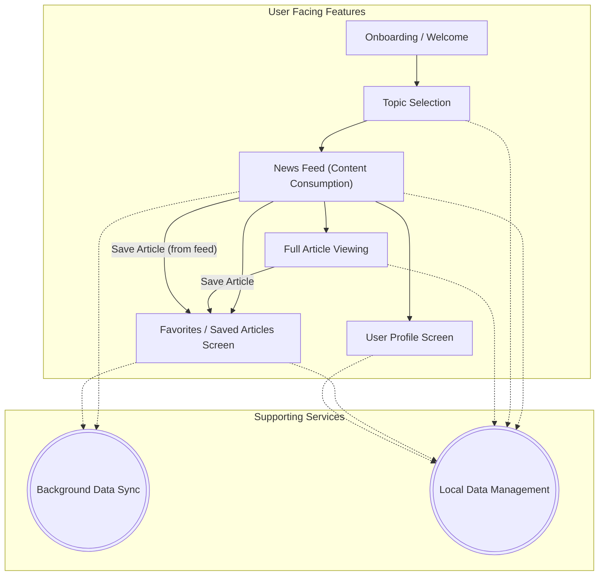

### Features to integrate

- [x] Pass Base url from gradle
- [X] Call Api And Directly show
- [X] Load App/button theme as dynamic system theme
- [X] Call API And Save to DB
  - [X] CATEGORIES DONE
  - [x] articles need to be done
- [x] Fetch data through workmanager (selected topic data)
- [x]  Newsfeed design
- [x]  newsfeed BottomSheet
- [x]  Save And Show Fav Articles
- [x] Complete Profile page
- [ ] Social Login
- [ ] Languages
- [ ] Full Article page
- [ ] Fav Page
- [ ] Saved items page
- [ ] paginate
  - [ ] api calls
  - [ ] room query data fetch

## Project Structure
```text
app/
├── .gitignore
├── build.gradle.kts
├── key/
│   └── testDebugKey.jks
├── proguard-rules.pro
├── proguard_other/
│   ├── gson_rules.pro
│   ├── okhttp-rules.pro
│   └── retrofit_rules.pro
└── src/
    └── main/
        ├── AndroidManifest.xml
        ├── ic_launcher-playstore.png
        ├── java/...    [omitted 69 descendants]
        ├── proto/...    [omitted 1 descendants]
        └── res/...    [omitted 52 descendants]
```

## Application Features
# Application Feature Overview

This document outlines the main features of the TechTrends application, based on codebase analysis.

**1. Core News/Content Consumption**
   - *Description:* Fetches news articles or content from an online API and displays them to the user, likely in a feed format.
   - *Key Components:* `api/ApiService.kt`, `core/MainRepository.kt`, `db/dao/FeedDao.kt`, `ui/screens/NewsFeedScreen.kt`, `ui/viewmodels/NewsFeedViewModel.kt`, `models/FeedItem.kt`

**2. Content Categorization & Topic Selection**
   - *Description:* Allows users to select topics of interest. Articles are likely categorized, and this selection filters the content shown to the user.
   - *Key Components:* `db/dao/CategoryDao.kt`, `models/CategoryModel.kt`, `ui/screens/TopicSelectScreen.kt`, `ui/viewmodels/ChooseTopicViewModel.kt`

**3. Full Article Viewing**
   - *Description:* Enables users to read the complete content of a selected news article.
   - *Key Components:* `ui/screens/FullArticleScreen.kt`, `ui/viewmodels/FullArticleVM.kt`

**4. Favorites/Saved Articles**
   - *Description:* Allows users to mark articles as favorites or save them for later reading. These are likely stored locally.
   - *Key Components:* `ui/screens/FavScreen.kt` (or `ui/screens/SavedScreen.kt`), `ui/viewmodels/FavViewModel.kt` (or `ui/viewmodels/SavedItemViewModel.kt`), `models/custom/FavCompanyItem.kt`, `db/MainDatabase.kt` (implicit for storing favorites)

**5. Background Data Sync**
   - *Description:* Periodically syncs data in the background, such as feeds for selected topics or user favorites, using WorkManager.
   - *Key Components:* `work/FeedSyncPerCategoryWorker.kt`, `di/DatabaseModule.kt` (for worker access to DB)

**6. User Profile**
   - *Description:* Provides a dedicated screen for user-related information or settings. May include locally stored preferences or account details.
   - *Key Components:* `ui/screens/ProfileScreen.kt`, `pref/TtPreferencesSerializer.kt` (for preferences)

**7. Onboarding/Welcome**
   - *Description:* Guides new users through initial setup, potentially including splash screens, welcome messages, and terms & conditions agreement.
   - *Key Components:* `ui/screens/SplashScreen.kt`, `ui/screens/WelcomeScreen.kt`

**8. UI & Navigation**
   - *Description:* Defines the overall user interface structure, including elements like a bottom navigation bar for easy access to different app sections, and consistent theming.
   - *Key Components:* `nav/BottomNavigationBar.kt`, `nav/TTNavGraph.kt`, `ui/theme/` (Color.kt, Theme.kt, Type.kt), `ui/MainActivity.kt`

**9. Local Data Management**
   - *Description:* Manages local storage of application data, including user preferences (via DataStore) and structured data like articles and categories (via Room database).
   - *Key Components:* `db/MainDatabase.kt`, `db/dao/CategoryDao.kt`, `db/dao/FeedDao.kt`, `pref/TtPreferencesSerializer.kt`, `di/DatabaseModule.kt`, `di/DataStoreModule.kt`

### Feature Diagram



